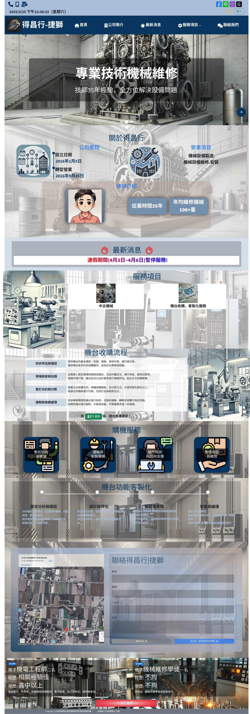
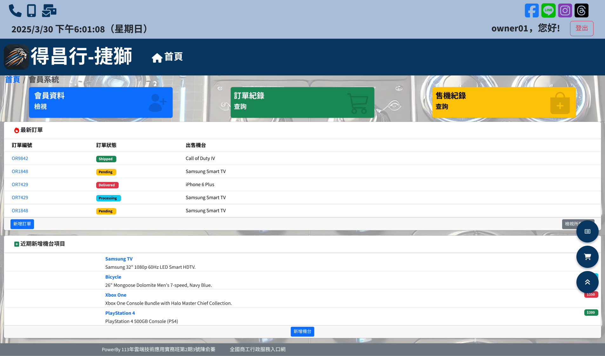
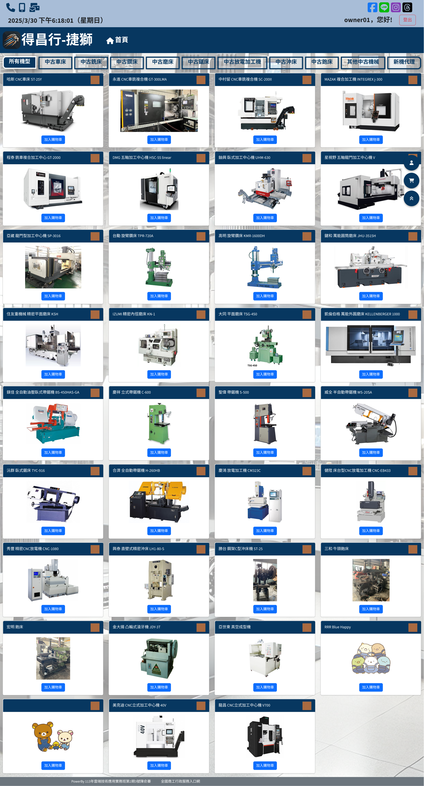
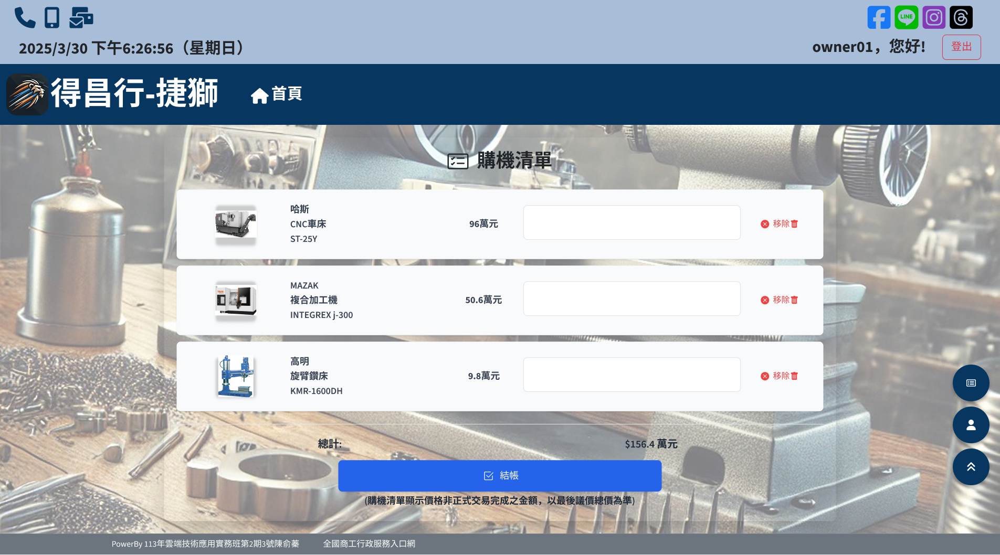
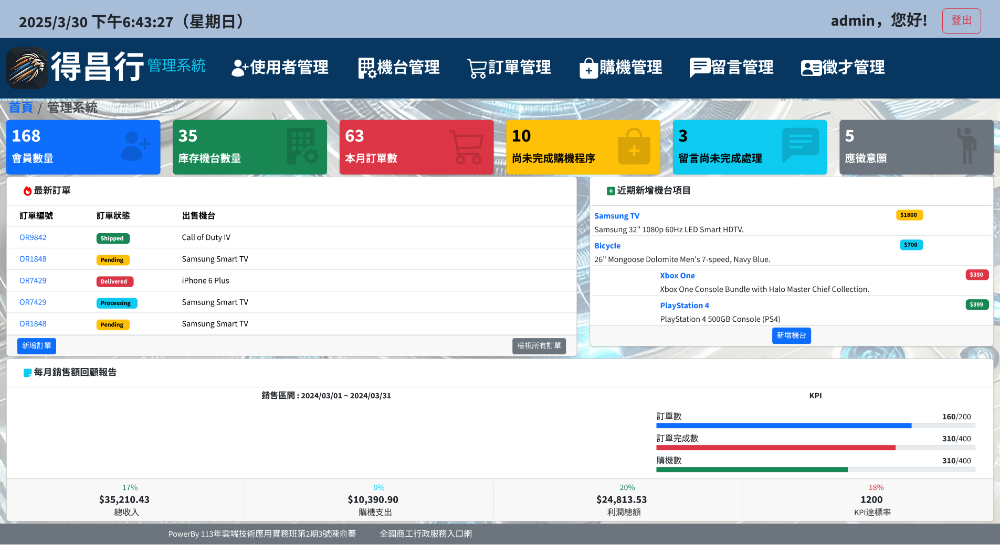
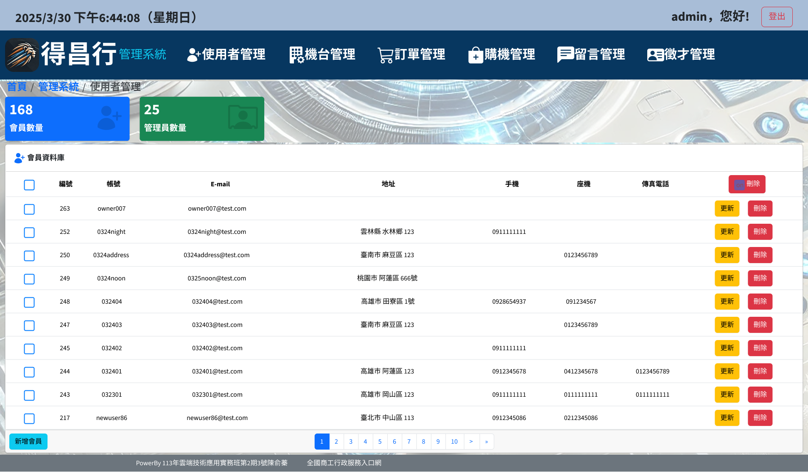
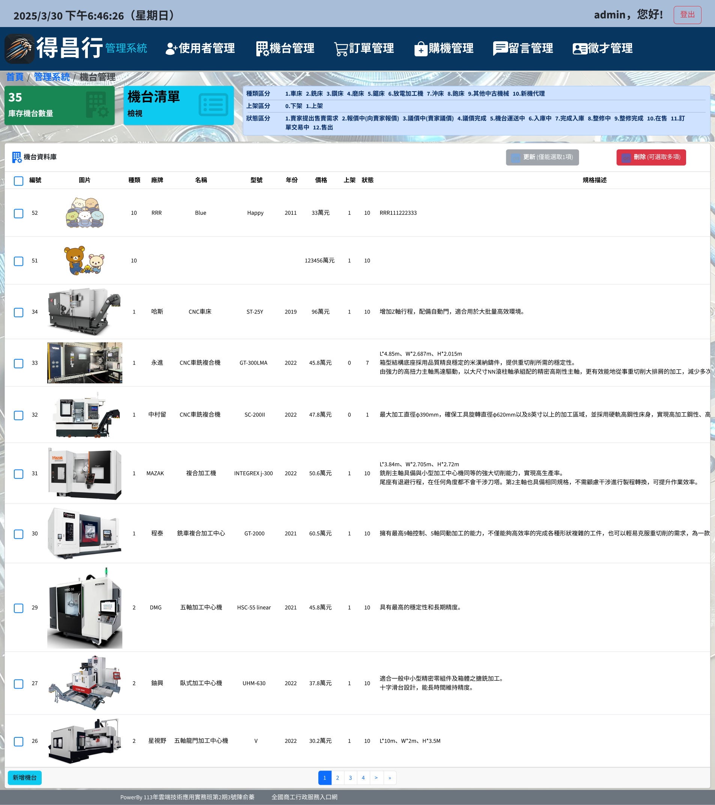
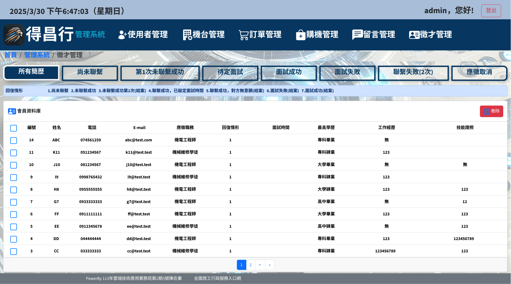

#  得昌行 | 捷獅 --- 中古機械商行 

## 📘 專案技術介紹

### 🔧 前端技術
-  **HTML**：用於結構化網頁內容  
-  **CSS**：設計和樣式化頁面  
-  **JavaScript**：用於互動功能及使用變數管理狀態（如模態框、按鈕點擊事件）  
-  **jQuery**：簡化 DOM 操作與動畫效果、發送 HTTP 請求、事件綁定  
-  **Bootstrap**：響應式設計與快速開發框架  
-  **Vue.js**：創建 Vue 運用，如動態生成年份選項  
-  **Wow.js**：網頁動畫效果  
-  **CounterUp**：數字計數動畫效果  
-  **SweetAlert2**：美觀提示框  
-  **Chart.js**：用於創建圖表（如機台數據分析條形圖與圓餅圖）  
-  **Font Awesome**：圖標庫（如電話、社群媒體圖示）  
-  **OverlayScrollbars**：自定義滾動條  
-  **Google Maps API**：嵌入地圖顯示位置  
-  **Cookies**：裝置儲存狀態資訊與追蹤瀏覽活動  
-  **Session Storage**：暫時儲存訊息  
-  **Local Storage**：持久儲存訊息（如保存滾動位置）

### 🛠️ 後端技術
-  **PHP**：後端處理請求邏輯  
-  **SQL**：資料庫資料管理與查詢處理  

### 🗄️ 資料庫環境
-  **Linux - Ubuntu**  
-  **WampServer - MySQL**

### 📚 其他工具

-  **Figma**：UI/UX 設計工具  
-  **GitHub**：版本控制與協作

---

## 📌 專案功能簡介
- 🔍 讓買家可以**瀏覽、搜尋中古機械**，並與商行聯繫進行交易  
- 🏷️ 賣家可**提供出售機械設備與價格**，由商行審核後進行收購  
- 📦 管理者能**上架機械設備**、管理庫存與價格、掌握收購進度  
- 🧾 管理者可**檢視與修改訂單狀態**

---

## 🖥️ 專案畫面展示
1.**網頁首頁**
  
  
2.**會員系統**
   
  
3.**商品頁面**
   
  
4.**購物車**
   
  
5.**管理系統**
   
  
6.**使用者管理**
   

7.**機台管理**
   

8.**徵才管理**
   

---

## 📬 聯絡作者

- 👩‍💻 作者：**陳俞蓁 Landy Chen**  
- 📧 Email：`landycheneje@gmail.com`
